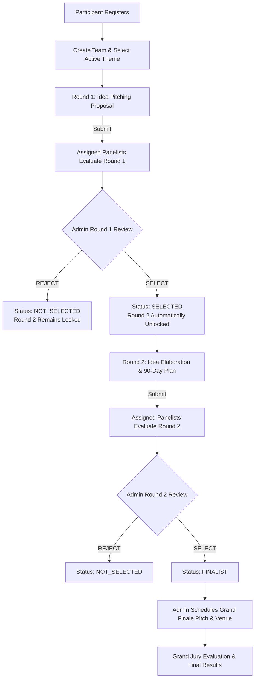

# 🌿 Hasiru Samvadha Ideathon Management System — Backend API

A complete, production-ready, modular REST API backend built in **Node.js**, **Express.js**, and **MongoDB/Mongoose** for managing a multi-stage Ideathon with 3 rounds, Role-Based Access Control (**Participant**, **Panelist**, **Admin**), automated scoring, and multi-channel notifications (In-App, Email, SMS).

---

## ⚡ Quick Start: What to Do After Cloning

Follow these simple steps after cloning the repository:

### 1. Clone the Repository
```bash
git clone https://github.com/LikhithRao15/Idiathon_2026-27.git
cd Idiathon_2026-27/backend
```

### 2. Install Dependencies
```bash
npm install
```

### 3. Setup Environment Variables (`.env`)
Create your `.env` file by copying the provided template:

**Windows (PowerShell / CMD):**
```powershell
copy .env.example .env
```
**Linux / macOS:**
```bash
cp .env.example .env
```

Open `.env` and configure your **MongoDB URI**:
```env
PORT=5000
NODE_ENV=development
API_PREFIX=/api
CLIENT_URL=http://localhost:3000

# Your MongoDB URI (Local or MongoDB Atlas)
MONGODB_URI=mongodb://127.0.0.1:27017/ideathon_db

# JWT Secret
JWT_SECRET=super_secret_jwt_key_for_ideathon_management_system_2026
JWT_EXPIRES_IN=7d

MAX_TEAM_SIZE=4
MIN_TEAM_SIZE=1

# Email Service (Nodemailer)
SMTP_HOST=smtp.gmail.com
SMTP_PORT=587
SMTP_SECURE=false
SMTP_USER=test@ideathon.org
SMTP_PASS=password123
EMAIL_FROM_NAME="Hasiru Samvadha Ideathon"
EMAIL_FROM_ADDRESS="no-reply@ideathon.org"

# SMS Service (mock | twilio | generic)
SMS_PROVIDER=mock
SMS_API_KEY=mock_sms_api_key
SMS_SENDER_ID=IDEATHON
```

---

### 4. Seed Database with Initial Data
Run the database seed script to automatically create:
- **1 System Admin**
- **2 Jury Panelists**
- **3 Official Ideathon Themes**
- **Sample Participants & Teams across Round 1, Round 2, and Finalist stages**

```bash
npm run seed
```

---

### 5. Start the Server

#### Development Mode (with hot-reload):
```bash
npm run dev
```

#### Production Mode:
```bash
npm start
```

Your API is now running live at:  
👉 **`http://localhost:5000`**  
👉 API Prefix: **`http://localhost:5000/api`**  
👉 Health Check: **`http://localhost:5000/health`**

---

### 6. Run Automated Tests
Run all 22 integration tests with an in-memory database:
```bash
npm test
```

---

## 🔑 Test Credentials for Development

Once you run `npm run seed`, you can immediately test the APIs with these pre-seeded accounts:

| Role | Email | Password | Assigned Status / Team |
|---|---|---|---|
| **Admin** | `admin@ideathon.org` | `Password@123` | Full administrative control |
| **Panelist 1** | `panelist1@ideathon.org` | `Password@123` | Assigned to `TEAM-2026-001` & `TEAM-2026-002` |
| **Panelist 2** | `panelist2@ideathon.org` | `Password@123` | Assigned to `TEAM-2026-002` & `TEAM-2026-003` |
| **Participant 1** | `rohan@example.com` | `Password@123` | Leader of **EcoTransformers** (Round 1 Submitted) |
| **Participant 2** | `priya@example.com` | `Password@123` | Leader of **HealthAI Diagnostics** (Round 1 Selected, Round 2 Submitted) |
| **Participant 3** | `kavya@example.com` | `Password@123` | Leader of **AgriVision IoT** (Grand Finalist) |

---

## 📮 Postman Collection

Import `backend/postman_collection.json` into Postman to test all endpoints with pre-configured request payloads, environment variables, and authentication headers.

---

## 📁 Project Architecture

```
Idiathon_2026-27/
│
├── backend/
│   ├── src/
│   │   ├── config/          # db.js, env.js
│   │   ├── controllers/     # auth, team, round1, round2, panelist, evaluation, admin, theme, notification
│   │   ├── middleware/      # auth (JWT), role (RBAC), error handling, validation
│   │   ├── models/          # User, Team, Theme, Round1Submission, Round2Submission, Evaluation, Notification, Event
│   │   ├── routes/          # REST route endpoints for each module
│   │   ├── services/        # emailService, smsService (abstraction), notificationService
│   │   ├── utils/           # generateTeamId, generateToken, response formatters
│   │   ├── validators/      # input validation rules using express-validator
│   │   ├── app.js           # Express app assembly & security middleware
│   │   └── seed.js          # Database seeding script
│   │
│   ├── tests/
│   │   └── ideathon.test.js # 22 automated integration tests
│   ├── server.js            # Node HTTP server entrypoint
│   ├── postman_collection.json
│   ├── .env.example
│   └── package.json
│
├── .gitignore
├── package.json             # Root helper scripts (install, dev, start, test, seed)
└── README.md
```

---

## 🔄 3-Round Competition Lifecycle & Workflow



---

## 🔒 Critical Business & Security Rules

1. **Strict Round 2 Gate**: Only teams whose `round1Status === 'SELECTED'` can access or submit Round 2. Attempting unauthorized access returns `403 Forbidden` with:
   ```json
   {
     "success": false,
     "message": "Round 2 is available only for teams selected in Round 1."
   }
   ```
2. **Panelist Assignment Isolation**: A panelist can only view and evaluate teams explicitly assigned to them by the admin.
3. **Automated Backend Scoring**: Scores across all rubrics are validated (0–10 each) and total scores are calculated automatically on the backend.
4. **Resilient Notifications**: If external email or SMS delivery encounters an error, the team selection and status updates succeed without failing.
5. **No Password Exposure**: Passwords use bcrypt hashing and are excluded from all query outputs and API responses.

---

## 📡 API Endpoints Overview

| Module | Route | Method | Description | Role |
|---|---|---|---|---|
| **Auth** | `/api/auth/register` | `POST` | Register participant | Public |
| **Auth** | `/api/auth/login` | `POST` | Login & get JWT token | Public |
| **Auth** | `/api/auth/me` | `GET` | Get logged-in user profile | Auth |
| **Themes** | `/api/themes` | `GET` | List active themes | Public |
| **Themes** | `/api/themes` | `POST` | Create new theme | Admin |
| **Teams** | `/api/teams` | `POST` | Create team with unique ID | Participant |
| **Teams** | `/api/teams/my-team` | `GET` | Get participant's team | Participant |
| **Round 1** | `/api/round1/submit` | `POST` | Submit Round 1 pitch | Participant Leader |
| **Round 1** | `/api/round1/submission` | `GET` | View Round 1 pitch | Auth |
| **Round 2** | `/api/round2/submit` | `POST` | Submit Round 2 elaboration | Participant Leader (Selected) |
| **Round 2** | `/api/round2/submission` | `GET` | View Round 2 proposal | Auth |
| **Evaluation** | `/api/evaluations/round1` | `POST` | Score Round 1 submission | Assigned Panelist |
| **Evaluation** | `/api/evaluations/round2` | `POST` | Score Round 2 submission | Assigned Panelist |
| **Evaluation** | `/api/evaluations/final` | `POST` | Score Grand Finalist | Grand Jury |
| **Admin** | `/api/admin/dashboard` | `GET` | Metrics & stage funnel | Admin |
| **Admin** | `/api/admin/teams/:id/round1/select` | `PUT` | Select team for Round 2 | Admin |
| **Admin** | `/api/admin/teams/:id/round1/reject` | `PUT` | Reject team in Round 1 | Admin |
| **Admin** | `/api/admin/teams/:id/round2/select` | `PUT` | Promote team to Finalist | Admin |
| **Admin** | `/api/admin/finalists` | `POST` | Schedule pitch slot & venue | Admin |
| **Admin** | `/api/admin/rounds` | `GET` | View round open/closed statuses | Admin |
| **Admin** | `/api/admin/rounds/:round/update` | `PUT` | Open/close rounds & deadlines | Admin |
| **Admin** | `/api/admin/panelists` | `GET` / `POST` | Manage panelist accounts | Admin |
| **Admin** | `/api/admin/assign-panelist` | `POST` | Assign panelist to team | Admin |
| **Panelist** | `/api/panelists/assigned-teams` | `GET` | View assigned teams | Panelist |
| **Notifications** | `/api/notifications` | `GET` | In-app alerts & unread count | Auth |
| **Notifications** | `/api/notifications/read-all` | `PATCH` | Mark all read | Auth |

---

## 📜 License
Licensed under ISC License. Developed for Hasiru Samvadha Ideathon.
