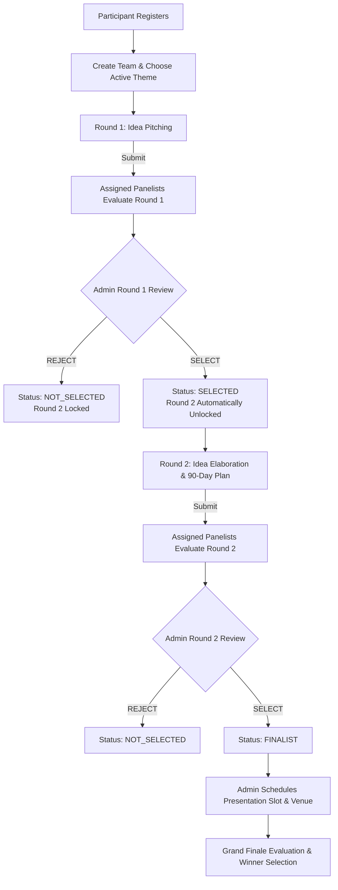

# 🌿 Hasiru Samvadha Ideathon Management System — Backend API

A production-ready, highly secure, modular RESTful backend engineered in **Node.js** and **Express.js** with **MongoDB & Mongoose**. The system coordinates a 3-round Ideathon challenge with strict Role-Based Access Control (**Participant**, **Panelist**, **Admin**), automated scoring, multi-channel notifications (In-app, Nodemailer Email, SMS abstraction layer), and complete round lifecycle management.

---

## 📑 Table of Contents
1. [Key Features](#-key-features)
2. [Technology Stack](#-technology-stack)
3. [Architecture & Folder Structure](#-architecture--folder-structure)
4. [User Roles & Access Permissions](#-user-roles--access-permissions)
5. [Competition Rounds & Workflow](#-competition-rounds--workflow)
6. [Strict Access Control Rules](#-strict-access-control-rules)
7. [Notification System](#-notification-system)
8. [Installation & Setup](#-installation--setup)
9. [Environment Variables](#-environment-variables)
10. [Database Seeding](#-database-seeding)
11. [Running the Application](#-running-the-application)
12. [Running Automated Tests](#-running-automated-tests)
13. [API Documentation & Endpoints](#-api-documentation--endpoints)
14. [Sample API Requests & Responses](#-sample-api-requests--responses)
15. [Test Credentials for Development](#-test-credentials-for-development)

---

## 🚀 Key Features

- 🔐 **Secure Authentication & RBAC**: JWT token-based auth with bcrypt-hashed passwords (never stored or exposed as plaintext).
- 👥 **Team Management**: Unique auto-generated team IDs (`TEAM-2026-XXX`), configurable team size caps, and strict duplicate-member prevention.
- 🎯 **3-Round Competition Engine**:
  - **Round 1 — Idea Pitching**: Draft saving, official submission lock, problem & solution evaluation.
  - **Round 2 — Idea Elaboration**: **Strictly gated** — unlocked only for teams marked `SELECTED` in Round 1.
  - **Grand Finale (Round 3)**: Finalist schedule management (venues, time slots, presentations) and Grand Jury scoring.
- ⚖️ **Panelist Evaluation Engine**: Panelists only view and evaluate assigned teams. Multi-criteria rubrics with automated backend score calculation.
- 📢 **Multi-Channel Notification Architecture**:
  - **In-App**: Real-time notifications with unread tracking.
  - **Email**: Responsive HTML templates dispatched via Nodemailer.
  - **SMS**: Modular provider abstraction (`mock`, `twilio`, `generic`) ensuring core selection workflows never fail on network issues.
- 🛡️ **Enterprise Security**: Helmet security headers, CORS origin management, centralized express-validator input sanitization, API rate-limiting, and standard error handling.

---

## 🛠 Technology Stack

- **Runtime**: Node.js (v18+)
- **Framework**: Express.js (v4.x)
- **Database**: MongoDB & Mongoose ODM
- **Security & Auth**: JWT (`jsonwebtoken`), `bcryptjs`, `helmet`, `cors`, `express-rate-limit`
- **Validation**: `express-validator`
- **Mailing**: `nodemailer`
- **SMS Integration**: Pluggable provider abstraction (`mock`, `twilio`, `generic`)
- **Testing**: `jest`, `supertest`, `mongodb-memory-server`

---

## 📁 Architecture & Folder Structure

```
backend/
├── src/
│   ├── config/
│   │   ├── db.js                 # MongoDB connection & lifecycle management
│   │   └── env.js                # Centralized environment variable manager
│   │
│   ├── models/
│   │   ├── User.js               # Participant, Panelist, Admin schema
│   │   ├── Team.js               # Teams, members, and lifecycle statuses
│   │   ├── Theme.js              # Competition theme tracks
│   │   ├── Round1Submission.js   # Round 1 idea pitching submissions
│   │   ├── Round2Submission.js   # Round 2 90-day elaboration submissions
│   │   ├── Evaluation.js         # Multi-round scoring criteria & comments
│   │   ├── Notification.js       # In-app notifications & channel history
│   │   └── Event.js              # Round states, deadlines & finalist schedules
│   │
│   ├── controllers/
│   │   ├── authController.js         # Register, login, getMe profile
│   │   ├── participantController.js  # Participant dashboards & event status
│   │   ├── teamController.js         # Team creation, membership, query
│   │   ├── round1Controller.js       # Round 1 draft and submission
│   │   ├── round2Controller.js       # Round 2 elaboration & access gate
│   │   ├── panelistController.js     # Assigned teams view & evaluations
│   │   ├── evaluationController.js   # Scoring criteria submission & summaries
│   │   ├── adminController.js        # Selection, round control, panelist assign
│   │   ├── notificationController.js # In-app notifications & read receipts
│   │   └── themeController.js        # Theme track management
│   │
│   ├── routes/
│   │   ├── authRoutes.js
│   │   ├── participantRoutes.js
│   │   ├── teamRoutes.js
│   │   ├── round1Routes.js
│   │   ├── round2Routes.js
│   │   ├── panelistRoutes.js
│   │   ├── evaluationRoutes.js
│   │   ├── adminRoutes.js
│   │   ├── notificationRoutes.js
│   │   └── themeRoutes.js
│   │
│   ├── middleware/
│   │   ├── authMiddleware.js         # JWT verification & req.user attachment
│   │   ├── roleMiddleware.js         # RBAC route protection
│   │   ├── errorMiddleware.js        # Centralized 404 & error handlers
│   │   └── validationMiddleware.js   # express-validator result formatter
│   │
│   ├── services/
│   │   ├── emailService.js           # Reusable HTML email templates
│   │   ├── smsService.js             # Provider-agnostic SMS abstraction
│   │   └── notificationService.js    # Multi-channel notification dispatcher
│   │
│   ├── utils/
│   │   ├── generateTeamId.js         # Formatted unique ID generator
│   │   ├── generateToken.js          # JWT sign & verify helpers
│   │   └── response.js               # Standard response formatting & AppError
│   │
│   ├── validators/
│   │   ├── authValidator.js
│   │   ├── teamValidator.js
│   │   ├── round1Validator.js
│   │   ├── round2Validator.js
│   │   ├── evaluationValidator.js
│   │   └── themeValidator.js
│   │
│   ├── seed.js                       # Comprehensive database seed script
│   └── app.js                        # Express app assembly & middleware
│
├── tests/
│   └── ideathon.test.js              # Automated integration tests
├── server.js                         # Application entrypoint & HTTP server
├── postman_collection.json           # Postman collection for all API routes
├── .env.example
├── .env
├── .gitignore
├── package.json
└── README.md
```

---

## 👥 User Roles & Access Permissions

| Role | Description | Accessible Endpoints |
|---|---|---|
| **participant** | Innovators submitting ideas | `/api/teams` (create/view own), `/api/round1/*`, `/api/round2/*`, `/api/notifications`, `/api/participants/dashboard`, `/api/finalists/:teamId` |
| **panelist** | Jury members evaluating submissions | `/api/panelists/*`, `/api/evaluations/*` (assigned teams only), `/api/teams` (assigned) |
| **admin** | Ideathon organizers & admins | Full administrative control: `/api/admin/*`, `/api/themes/*`, `/api/admin/rounds/*`, `/api/admin/panelists/*` |

---

## 🔄 Competition Rounds & Workflow



---

## 🔒 Strict Access Control Rules

1. **Round 2 Gate**: Any attempt to submit or view Round 2 while `round1Status !== 'SELECTED'` immediately returns:
   ```json
   {
     "success": false,
     "message": "Round 2 is available only for teams selected in Round 1."
   }
   ```
2. **Panelist Assignment Gate**: A panelist can only access and score teams explicitly assigned to them.
3. **Leader Authority**: Only the designated Team Leader can create the team and submit official proposals.
4. **Duplicate Safeguards**: Participants cannot belong to multiple teams simultaneously by email or phone.

---

## 🔔 Notification System

| Trigger Event | In-App Alert | HTML Email | SMS Notification |
|---|---|---|---|
| Participant Registered | ✅ Yes | ✅ Registration Confirmation | ✅ Welcome SMS |
| Round 1 Proposal Submitted | ✅ Yes | — | — |
| Round 1 Team Selected | ✅ Yes | ✅ Selection & R2 Instructions | ✅ Crucial SMS Alert |
| Round 1 Team Rejected | ✅ Yes | ✅ Participation Acknowledgment | ✅ Update SMS |
| Round 2 Finalist Promoted | ✅ Yes | ✅ Grand Finalist Congratulatory | ✅ Crucial SMS Alert |
| Finalist Slot Scheduled | ✅ Yes | ✅ Venue, Time & Pitch Details | ✅ Venue Reminder SMS |
| Final Results Announced | ✅ Yes | ✅ Official Result Email | ✅ Result SMS |

---

## 📦 Installation & Setup

### Prerequisites
- Node.js (v18.x or v20+)
- MongoDB running locally (`mongodb://127.0.0.1:27017`) or a MongoDB Atlas URI

### 1. Clone or Open Project
```bash
cd backend
```

### 2. Install Dependencies
```bash
npm install
```

### 3. Configure Environment Variables
Copy `.env.example` to `.env`:
```bash
cp .env.example .env
```

---

## ⚙️ Environment Variables

```env
# Server Configuration
PORT=5000
NODE_ENV=development
API_PREFIX=/api
CLIENT_URL=http://localhost:3000

# MongoDB Database URI
MONGODB_URI=mongodb://127.0.0.1:27017/ideathon_db

# JWT Configuration
JWT_SECRET=super_secret_jwt_key_for_ideathon_management_system_2026
JWT_EXPIRES_IN=7d

# Team Constraints
MAX_TEAM_SIZE=4
MIN_TEAM_SIZE=1

# Email Service Configuration (Nodemailer)
SMTP_HOST=smtp.gmail.com
SMTP_PORT=587
SMTP_SECURE=false
SMTP_USER=your-email@gmail.com
SMTP_PASS=your-app-password
EMAIL_FROM_NAME="Hasiru Samvadha Ideathon"
EMAIL_FROM_ADDRESS="no-reply@ideathon.org"

# SMS Service Configuration (Providers: mock | twilio | generic)
SMS_PROVIDER=mock
SMS_API_KEY=mock_sms_api_key
SMS_SENDER_ID=IDEATHON
```

---

## 🌾 Database Seeding

Run the seed script to automatically create:
- **1 Admin Account**
- **2 Panelist Accounts**
- **3 Competition Themes**
- **Sample Participants, Teams, and Submissions across all 3 rounds**

```bash
npm run seed
```

---

## 💻 Running the Application

### Start Development Server (with nodemon auto-restart)
```bash
npm run dev
```

### Start Production Server
```bash
npm start
```

Default Server Address: **`http://localhost:5000`**  
API Prefix: **`/api`**

---

## 🧪 Running Automated Tests

Run the comprehensive test suite with in-memory MongoDB:
```bash
npm test
```

---

## 📡 API Documentation & Endpoints

### 1. Authentication (`/api/auth`)
- `POST /api/auth/register` — Register a new participant
- `POST /api/auth/login` — Login & obtain JWT token
- `GET /api/auth/me` — Get profile & current team status `[Auth]`

### 2. Themes (`/api/themes`)
- `GET /api/themes` — List active themes
- `GET /api/themes/:id` — Get theme details
- `POST /api/themes` — Create theme `[Admin]`
- `PUT /api/themes/:id` — Update theme `[Admin]`
- `DELETE /api/themes/:id` — Delete theme `[Admin]`

### 3. Teams (`/api/teams`)
- `POST /api/teams` — Create team `[Participant]`
- `GET /api/teams/my-team` — Get current participant's team `[Participant]`
- `PUT /api/teams/my-team` — Update team members `[Participant Leader]`
- `GET /api/teams` — List teams `[Admin / Panelist]`
- `GET /api/teams/:id` — Get team by ID `[Auth]`

### 4. Round 1 — Idea Pitching (`/api/round1`)
- `POST /api/round1/submit` — Submit idea pitch or draft `[Participant Leader]`
- `GET /api/round1/submission` — Get team's Round 1 proposal `[Auth]`
- `PUT /api/round1/submission/:id` — Update draft or status `[Auth]`

### 5. Round 2 — Idea Elaboration (`/api/round2`)
- `POST /api/round2/submit` — Submit 90-day plan & budget `[Participant Leader - Gated by R1 Selection]`
- `GET /api/round2/submission` — Get Round 2 proposal `[Auth]`
- `PUT /api/round2/submission/:id` — Update Round 2 proposal `[Auth]`

### 6. Evaluations (`/api/evaluations`)
- `POST /api/evaluations/round1` — Evaluate Round 1 pitch `[Assigned Panelist / Admin]`
- `GET /api/evaluations/round1` — Get Round 1 scores `[Panelist / Admin]`
- `POST /api/evaluations/round2` — Evaluate Round 2 elaboration `[Assigned Panelist / Admin]`
- `GET /api/evaluations/round2` — Get Round 2 scores `[Panelist / Admin]`
- `POST /api/evaluations/final` — Evaluate Grand Finalist `[Panelist / Admin]`
- `GET /api/evaluations/team/:teamId` — Aggregate score summary `[Panelist / Admin]`

### 7. Panelist Workflows (`/api/panelists`)
- `GET /api/panelists/assigned-teams` — View only teams assigned to the panelist `[Panelist]`
- `GET /api/panelists/assigned-teams/:teamId` — View assigned team proposal details `[Panelist]`
- `GET /api/panelists/dashboard` — Review progress metrics `[Panelist]`

### 8. Admin Operations (`/api/admin`)
- `GET /api/admin/dashboard` — Comprehensive metrics, counts, and funnel analysis `[Admin]`
- `PUT /api/admin/teams/:teamId/round1/select` — Select team for Round 2 `[Admin]`
- `PUT /api/admin/teams/:teamId/round1/reject` — Reject team in Round 1 `[Admin]`
- `PUT /api/admin/teams/:teamId/round2/select` — Promote team to Grand Finalist `[Admin]`
- `PUT /api/admin/teams/:teamId/round2/reject` — Reject team in Round 2 `[Admin]`
- `POST /api/admin/finalists` — Schedule finalist pitch slot & venue `[Admin]`
- `GET /api/admin/rounds` — Get round open/closed statuses `[Admin]`
- `PUT /api/admin/rounds/:round/update` — Update round status / deadlines `[Admin]`
- `GET /api/admin/panelists` — List panelist accounts `[Admin]`
- `POST /api/admin/panelists` — Create panelist account `[Admin]`
- `POST /api/admin/assign-panelist` — Assign panelist to team `[Admin]`

### 9. Notifications (`/api/notifications`)
- `GET /api/notifications` — Get user notifications (paginated + unread count) `[Auth]`
- `PATCH /api/notifications/:id/read` — Mark notification read `[Auth]`
- `PATCH /api/notifications/read-all` — Mark all read `[Auth]`

### 10. Participant Summary (`/api/participants`)
- `GET /api/participants/dashboard` — Participant stage access flags & unlock status `[Participant]`
- `GET /api/participants/event-status` — Public event & theme status `[Public]`
- `GET /api/finalists/:teamId` — Finalist pitch details `[Finalist / Admin]`

---

## 📋 Sample API Requests & Responses

### 1. Register Participant
**`POST /api/auth/register`**
```json
{
  "name": "Rohan Mehta",
  "email": "rohan@example.com",
  "phone": "+919876543220",
  "password": "Password@123"
}
```
**Response (201 Created):**
```json
{
  "success": true,
  "message": "Registration successful. Welcome to the Ideathon!",
  "data": {
    "token": "eyJhbGciOiJIUzI1NiIsInR5cCI6...",
    "user": {
      "id": "65dfa1b2c3d4e5f678901201",
      "name": "Rohan Mehta",
      "email": "rohan@example.com",
      "phone": "+919876543220",
      "role": "participant",
      "isActive": true
    }
  }
}
```

### 2. Create Team
**`POST /api/teams`**  
*Header: `Authorization: Bearer <token>`*
```json
{
  "teamName": "EcoTransformers",
  "theme": "65dfa1b2c3d4e5f678901202",
  "members": [
    {
      "name": "Sameer Verma",
      "email": "sameer@example.com",
      "phone": "+919876543231",
      "roleInTeam": "Hardware Engineer"
    }
  ]
}
```
**Response (201 Created):**
```json
{
  "success": true,
  "message": "Team created successfully.",
  "data": {
    "_id": "65dfa1b2c3d4e5f678901203",
    "teamId": "TEAM-2026-001",
    "teamName": "EcoTransformers",
    "round1Status": "NOT_SUBMITTED",
    "round2Status": "LOCKED",
    "finalStatus": "NOT_QUALIFIED"
  }
}
```

### 3. Evaluate Round 1 (Panelist)
**`POST /api/evaluations/round1`**
```json
{
  "teamId": "65dfa1b2c3d4e5f678901203",
  "scores": {
    "problemUnderstanding": 9,
    "innovation": 8.5,
    "proposedSolution": 9,
    "feasibility": 8,
    "expectedImpact": 8.5
  },
  "comments": "High feasibility with tangible environmental impact in urban clusters."
}
```
**Response (201 Created):**
```json
{
  "success": true,
  "message": "Round 1 evaluation submitted successfully.",
  "data": {
    "teamId": "65dfa1b2c3d4e5f678901203",
    "round": 1,
    "scores": {
      "problemUnderstanding": 9,
      "innovation": 8.5,
      "proposedSolution": 9,
      "feasibility": 8,
      "expectedImpact": 8.5
    },
    "totalScore": 43,
    "comments": "High feasibility with tangible environmental impact in urban clusters."
  }
}
```

---

## 🔑 Test Credentials for Development

Once seeded via `npm run seed`, the following accounts are ready for testing:

| Role | Email | Password | Details / Assigned State |
|---|---|---|---|
| **Admin** | `admin@ideathon.org` | `Password@123` | Full administrative powers |
| **Panelist 1** | `panelist1@ideathon.org` | `Password@123` | Assigned to EcoTransformers & HealthAI |
| **Panelist 2** | `panelist2@ideathon.org` | `Password@123` | Assigned to HealthAI & AgriVision |
| **Participant 1** | `rohan@example.com` | `Password@123` | Leader of **EcoTransformers** (R1 Submitted) |
| **Participant 2** | `priya@example.com` | `Password@123` | Leader of **HealthAI Diagnostics** (R1 Selected, R2 Submitted) |
| **Participant 3** | `kavya@example.com` | `Password@123` | Leader of **AgriVision IoT** (Grand Finalist) |

---

## 🌟 Postman Collection
Import `postman_collection.json` directly into Postman to test all endpoints with preconfigured variables and sample payloads.
